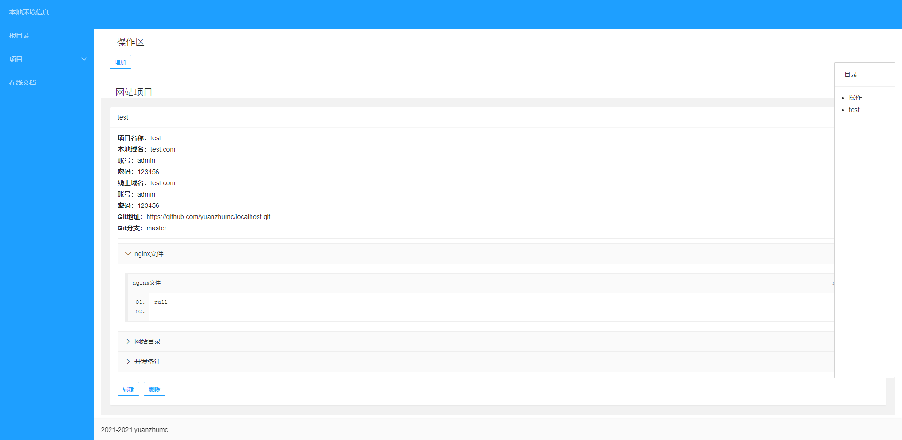

# 本地环境管理-网站信息目录导航

# 特点
简介、轻便、快速、方便、灵活自定义、随时安装

# 介绍

[](template/asster/img/img1.png)

## （一）能干什么

在本地或测试环境进行团队协作开发或个人开发，因为网站的比较多，相关的信息不统一化，导致配置一个网站需要翻很多文件或网页

在这里，您使用到这个，能为您更改的整理资料

## （二）这是个什么？

此项目为个人开发项目
主要功能以相当与记事本效果

# 相关配置
php>7.1
需要json扩展
请给予本项目目录777权限

# 使用方式
使用git克隆本项目

`
git clone -b master https://github.com/yuanzhumc/localhost.git
`

配置php环境

配置.env文件
样式文件为 **.env.local.example**

接下来访问一次您的网站，就可以使用啦

# .env介绍

```
#本地环境文件配置
[localhost]
#nginx网站配置文件目录
nginxconf=/usr/local/nginx/conf/vhost/
#所有网站根目录
wwwroot=/data/wwwroot/
#所有网站的.env配置文件名称
wwwrootenv=.env

#网站信息配置
[config]
#网站标题
headertitle=yuanzhumc-本地环境信息
#网站页脚
footer=yuanzhumc

#本地网站项目的信息变量配置
[project]
#变量的配置文件
json=app/data/ProjectParam.json
#是否显示nginx配置
nginx=true
#是否显示env配置
env=true
#是否显示开发备注
remarks=true
```

# 如何自定义右侧菜单？

## 内容文件
### 1.json形式编辑
配置好.env后，先访问一次您的网站

在 **app/data/** 目录下会生成一个 **munu.json** 的文件，此为菜单内容文件

查看并编辑 **munu.json**
```json
[{
	"title": "本地环境信息",
	"type": "in",
	"url": "app\/index",
	"target": "_self"
}, {
	"title": "根目录",
	"type": "in",
	"url": "app\/file",
	"target": "_self"
}, {
	"title": "项目",
	"type": "in_child",
	"url": null,
	"target": "javascript:;",
	"child": "project"
}, {
	"title": "公司",
	"type": "in_child_in",
	"url": "app\/project&mode=company",
	"target": "_self",
	"child": "project"
}, {
	"title": "我的",
	"type": "in_child_in",
	"url": "app\/project&mode=my",
	"target": "_self",
	"child": "project"
}, {
	"title": "在线文档",
	"type": "in",
	"url": "app\/word",
	"target": "_self"
}]
```
### 2.数组形式编辑
在 **app/** 目录下有一个 **common** 的文件，此为主要助手函数文件

搜索`munu`

变量`$munuArray`就是数组形式的菜单内容

注意：在此文件更改后，需要删除`app/data/munu.json`，任何访问网站，会重新生成一个munu.json，里面的内容会变成您刚刚更改的内容

```php
$munuArray=[
            ['title'=>'本地环境信息','type'=>'in','url'=>'app/index','target'=>'_self'],
            ['title'=>'根目录','type'=>'in','url'=>'app/file','target'=>'_self'],
            ['title'=>'项目','type'=>'in_child','url'=>null,'target'=>'javascript:;','child'=>'project'],
            ['title'=>'公司','type'=>'in_child_in','url'=>'app/project&mode=company','target'=>'_self','child'=>'project'],
            ['title'=>'我的','type'=>'in_child_in','url'=>'app/project&mode=my','target'=>'_self','child'=>'project'],
            ['title'=>'在线文档','type'=>'in','url'=>'app/word','target'=>'_self'],
        ];
```

## 参数说明
**title** 菜单标题

**type** 菜单形式

`in`代表第一级菜单

`in_child`代表第二级菜单的父级名称

`in_child_in`代表第二级菜单的内容

**url** 导向链接或应用

这里可以为超链接或应用

应用：app/index，会自动调用`template/view/app/index.php`

**target** 链接属性

**child** 用于指定父级标识和二级菜单引用父级的标识

# 如何自定义项目应用的表单参数？

## 内容文件
### 1.json形式编辑
配置好.env后，先访问一次您的网站

在 **app/data/** 目录下会生成一个 **ProjectParam.json** 的文件，此为表单参数配置内容文件

查看并编辑 **ProjectParam.json**
```json
{
	"common": [{
		"title": "项目名称",
		"name": "title",
		"type": "text",
		"required": true,
		"href": false,
		"hrefStart": "http:\/\/",
		"hrefEnd": "\/"
	}, {
		"title": "本地域名",
		"name": "localhost",
		"type": "text",
		"required": true,
		"href": true,
		"hrefStart": "http:\/\/",
		"hrefEnd": "\/"
	}, {
		"title": "账号",
		"name": "localUser",
		"type": "text",
		"required": true,
		"href": false,
		"hrefStart": "http:\/\/",
		"hrefEnd": "\/"
	}, {
		"title": "密码",
		"name": "localPass",
		"type": "text",
		"required": true,
		"href": false,
		"hrefStart": "http:\/\/",
		"hrefEnd": "\/"
	}, {
		"title": "线上域名",
		"name": "domain",
		"type": "text",
		"required": false,
		"href": true,
		"hrefStart": "http:\/\/",
		"hrefEnd": "\/"
	}, {
		"title": "账号",
		"name": "domainUser",
		"type": "text",
		"required": false,
		"href": false,
		"hrefStart": "http:\/\/",
		"hrefEnd": "\/"
	}, {
		"title": "密码",
		"name": "domainPass",
		"type": "text",
		"required": false,
		"href": false,
		"hrefStart": "http:\/\/",
		"hrefEnd": "\/"
	}, {
		"title": "Git地址",
		"name": "git",
		"type": "text",
		"required": false,
		"href": true,
		"hrefStart": "http:\/\/",
		"hrefEnd": "\/"
	}, {
		"title": "Git分支",
		"name": "gitBranch",
		"type": "text",
		"required": false,
		"href": false,
		"hrefStart": "http:\/\/",
		"hrefEnd": "\/"
	}, {
		"title": "nginx文件",
		"name": "nginx",
		"type": "nginx",
		"required": false,
		"href": false,
		"hrefStart": "http:\/\/",
		"hrefEnd": "\/"
	}, {
		"title": "网站目录",
		"name": "env",
		"type": "env",
		"required": false,
		"href": false,
		"hrefStart": "http:\/\/",
		"hrefEnd": "\/"
	}, {
		"title": "开发备注",
		"name": "remarks",
		"type": "remarks",
		"required": false,
		"href": false,
		"hrefStart": "http:\/\/",
		"hrefEnd": "\/"
	}]
}
```
### 2.数组形式编辑
在 **app/** 目录下有一个 **common** 的文件，此为主要助手函数文件

搜索`ProjectParamFile`

变量`$Array`就是数组形式的菜单内容

注意：在此文件更改后，需要删除`app/data/ProjectParam.json`，任何访问网站，会重新生成一个ProjectParam.json，里面的内容会变成您刚刚更改的内容

```php
$Array = [
        'common' => [
            [
                'title' => '项目名称',
                'name' => 'title',
                'type' => 'text',
                "required" => true,
                "href" => false,
                "hrefStart" => "http://",
                "hrefEnd" => "/"
            ],
            [
                "title" => "本地域名",
                "name" => "localhost",
                "type" => "text",
                "required" => true,
                "href" => true,
                "hrefStart" => "http://",
                "hrefEnd" => "/"
            ],
            [
                "title" => "账号",
                "name" => "localUser",
                "type" => "text",
                "required" => true,
                "href" => false,
                "hrefStart" => "http://",
                "hrefEnd" => "/"
            ],
            [
                "title" => "密码",
                "name" => "localPass",
                "type" => "text",
                "required" => true,
                "href" => false,
                "hrefStart" => "http://",
                "hrefEnd" => "/"
            ],
            [
                "title" => "线上域名",
                "name" => "domain",
                "type" => "text",
                "required" => false,
                "href" => true,
                "hrefStart" => "http://",
                "hrefEnd" => "/"
            ],
            [
                "title" => "账号",
                "name" => "domainUser",
                "type" => "text",
                "required" => false,
                "href" => false,
                "hrefStart" => "http://",
                "hrefEnd" => "/"
            ],
            [
                "title" => "密码",
                "name" => "domainPass",
                "type" => "text",
                "required" => false,
                "href" => false,
                "hrefStart" => "http://",
                "hrefEnd" => "/"
            ],
            [
                "title" => "Git地址",
                "name" => "git",
                "type" => "text",
                "required" => false,
                "href" => true,
                "hrefStart" => "http://",
                "hrefEnd" => "/"
            ],
            [
                "title" => "Git分支",
                "name" => "gitBranch",
                "type" => "text",
                "required" => false,
                "href" => false,
                "hrefStart" => "http://",
                "hrefEnd" => "/"
            ],
            [
                "title" => "nginx文件",
                "name" => "nginx",
                "type" => "nginx",
                "required" => false,
                "href" => false,
                "hrefStart" => "http://",
                "hrefEnd" => "/"
            ],
            [
                "title" => "网站目录",
                "name" => "env",
                "type" => "env",
                "required" => false,
                "href" => false,
                "hrefStart" => "http://",
                "hrefEnd" => "/"
            ],
            [
                "title" => "开发备注",
                "name" => "remarks",
                "type" => "remarks",
                "required" => false,
                "href" => false,
                "hrefStart" => "http://",
                "hrefEnd" => "/"
            ]
        ]
    ];
```
## 参数说明
**title** 参数名称

**name** 参数表单标识（注：name内必须需要一个值为**title**，否则前台页面的项目显示为空）

**type** 内容方式

一般的内容请填`text`就行

`nginx` 为配置nginx的 *.conf 文件表单，此项如果不想要显示可以删除或不添加，同时.env里的[project]nginx设置为false

此项为前台折叠面版的高亮代码显示，表单里为text

`env` 为配置网站目录下的的 .env 文件表单，此项如果不想要显示可以删除或不添加，同时.env里的[project]env设置为false

此项为前台折叠面版的高亮代码显示，表单里为text

`remarks` 为配置开发备注表单，此项如果不想要显示可以删除或不添加，同时.env里的[project]remarks设置为false

此项为前台折叠面版的内容显示，表单里为textarea

**required** 是否必填

**href** 是否显示为链接，如果为链接，表单内容请填写域名，或自定义 **hrefStart** 和 **hrefEnd**

**hrefStart** 如果显示为链接，用户在点击链接跳转的时候，这里为http协议头

**hrefEnd** 如果显示为链接，用户在点击链接跳转的时候，这里为链接后的地址，可以带参数
